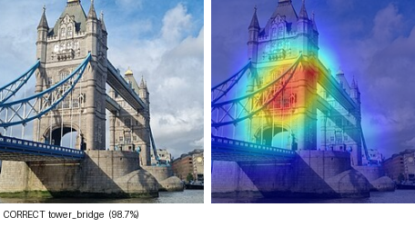
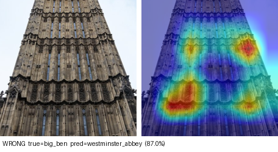

# LandmarkLens

Recognises London landmarks and transit signage from a photo, and returns the
place name with a Grad-CAM heatmap showing what the model looked at.

The recognised name is fed into [TravelAssistant](../../TravelAssistantFinal),
a London journey-planning chatbot, as a normal location entity. Photograph a
landmark, get a TfL journey.



## Results

Held-out test set, 253 images:

| | |
|---|---:|
| Top-1 accuracy | 86.17% |
| Top-3 accuracy | 96.84% |
| Macro F1 | 0.861 |

Inference latency, batch 1, 200 runs, Intel i7-1355U on AC power:

| Variant | Median | Speedup | Size | Top-1 |
|---|---:|---:|---:|---:|
| PyTorch FP32 | 85.73 ms | 1.00x | 90.1 MB | 86.17% |
| ONNX Runtime FP32 | 34.35 ms | 2.50x | 89.7 MB | 86.17% |
| ONNX Runtime INT8 static | 11.77 ms | 7.28x | 22.9 MB | 85.77% |

Full tables, per-class scores and confusion pairs: [`docs/RESULTS.md`](docs/RESULTS.md).

## Classes

16 classes. Eleven name a specific place (Tower Bridge, The Shard, St Pancras
International, Big Ben, London Eye, St Paul's Cathedral, Buckingham Palace,
Nelson's Column, The Gherkin, Westminster Abbey, Tower of London). Five name a
*kind* of place: tube roundel, bus stop flag, double-decker bus, black cab, red
telephone box.

That distinction is carried in the API as a `resolvable` flag. A photo of a bus
stop tells you it is a bus stop, not which one, so those classes are never
routed to as a destination — the consumer asks the user instead.

## Dataset

1,698 images, 97–110 per class, harvested from Wikimedia Commons.
`scripts/harvest_dataset.py` keeps only files whose licence is on a
free-licence allow-list, and records the author, licence and source URL of
every one. See [`DATA_SOURCES.md`](DATA_SOURCES.md); the per-image records are
in `data/attribution/`.

Split 1,192 train / 253 val / 253 test, stratified, seed 42.

## Model

ResNet50 with ImageNet weights, `fc` replaced with `Dropout(0.2) → Linear(2048, 16)`.

Trained in two phases: a frozen-backbone warmup for the new head at LR 1e-3,
then `layer4` fine-tuned at 1e-4 under a cosine schedule. Keeping layers 1–3
frozen is what makes ~100 images per class workable, and it halves CPU training
time. AdamW, label smoothing 0.05, inverse-frequency class weights for the
uneven Commons yield.

Augmentation targets phone photos taken on the street: random resized crop
(scale 0.6–1.0), horizontal flip, colour jitter.

## Experiments

Three runs in MLflow (local file store, `./mlruns`), each changing one thing:

| Run | Change | Val top-1 | Val top-3 |
|---|---|---:|---:|
| `high_lr` (selected) | fine-tune LR 1e-3 | 85.77% | 94.86% |
| `baseline` | fine-tune LR 1e-4 | 85.77% | 93.68% |
| `strong_aug` | + rotation, grayscale, erasing | 85.38% | 93.28% |

Stronger augmentation made it slightly worse, which suggests the model is
limited by data volume rather than by overfitting.

```bash
mlflow ui --backend-store-uri ./mlruns
```

## Quantization

Static INT8 with the default MinMax calibration dropped accuracy from 86.17% to
**56.13%** while looking like a clean 8x speedup. MinMax sets the quantization
range from the single most extreme activation it sees, and one outlier
collapses everything else into a handful of levels. Percentile calibration
brings it back to 85.77%, a 0.40 point cost.

Two other things that cost time:

- PyTorch dynamic INT8 is slightly *slower* than FP32 here. It only quantizes
  `nn.Linear`, which on a ResNet50 is just the classifier head.
- The histogram calibrators fail on a graph exported with a dynamic batch axis,
  so `export_onnx.py` emits a separate fixed batch-1 graph to quantize from.

## Grad-CAM



The most useful error. This crop of the Elizabeth Tower has no clock face in
frame, and the heatmap sits on the Gothic tracery — the feature Big Ben shares
with Westminster Abbey. The model is looking at the right thing and reaching a
defensible wrong answer.

One panel per class and the six most confident mistakes are in `docs/gradcam/`.

## API

```
GET  /healthz            model info
GET  /classes            class list and location mapping
POST /predict            image upload, returns JSON
GET  /heatmap/<id>.png   Grad-CAM overlay from a /predict call
```

`POST /predict` takes a multipart field named `image` (or `file`).
`?heatmap=false` skips overlay generation.

```json
{
  "location_name": "Tower Bridge",
  "confidence": 0.9315,
  "heatmap_url": "/heatmap/3f2c….png",
  "class": "tower_bridge",
  "resolvable": true,
  "low_confidence": false,
  "predictions": [ … ]
}
```

Environment: `LANDMARKLENS_CHECKPOINT`, `LANDMARKLENS_BACKEND` (`torch` or
`onnx`), `LANDMARKLENS_ONNX`, `LANDMARKLENS_THREADS`,
`LANDMARKLENS_MIN_CONFIDENCE`.

Grad-CAM always runs on the PyTorch weights since it needs gradients, even when
predictions are served from ONNX.

```bash
PYTHONPATH=. .venv/Scripts/python backend/app.py    # :8000
docker compose up --build                            # see Limitations
```

## TravelAssistant integration

TravelAssistant's `POST /chat_photo` sends the image here, takes the returned
`location_name`, and puts it in the same `nlp_origin` / `nlp_destination` slot
its text pipeline fills. Everything downstream — disambiguation, geocoding, the
TfL Journey API — is unchanged. The two projects only talk over HTTP.

Verified end to end, 8/8 checks. A photo of Tower Bridge was recognised at
93.15%, combined with "from Waterloo" typed alongside it, and returned three
TfL journeys (first: 29 min, walk to Waterloo East, Southeastern to London
Bridge, 343 bus, walk).

```bash
cd TravelAssistantFinal
python test_landmarklens_integration.py
```

## Reproducing

```bash
python -m venv .venv
.venv/Scripts/pip install --index-url https://download.pytorch.org/whl/cpu \
    torch==2.5.1 torchvision==0.20.1
.venv/Scripts/pip install -r requirements-dev.txt
bash run_all.sh
```

`run_all.sh` runs harvest → split → three training runs → evaluate → Grad-CAM →
ONNX export → benchmark → report. Individual steps are in `scripts/`.

## Limitations

**Dataset.** 1,698 images is small. The test split is 15–16 images per class, so
one extra mistake moves a class's recall by about 6 points; treat per-class
numbers as indicative. One fixed split, no cross-validation.

`bus_stop_flag` is the weakest class (F1 0.77) because the Commons category is
mostly wide street scenes where the bus stop is a distant detail rather than
close-ups of the sign. `double_decker_bus` (F1 0.69) confuses with the other
street-furniture classes, which co-occur in the same photographs.
`tube_roundel` includes roundel parodies and roundel-styled shop signage.

Commons photography is not phone photography — good light, considered framing,
clear view. Expect real-world accuracy below the reported figure.

**Model.** No "none of the above" class. Shown a photo of Paris it will
confidently return a London class; the 0.45 confidence floor is the only guard.
Only `layer4` was fine-tuned, and no broader hyperparameter search was run —
training was CPU-only.

**Measurement.** Latency depends on the machine's power state as much as the
model: the same benchmark gave 85.7 ms on AC and 332.9 ms on battery, because
Windows caps this CPU at 1.7 GHz on battery. Quote the ratio, or quote the
absolute figure with its power state. The accuracy-bearing benchmark run
(in `docs/RESULTS.md`) was taken on battery; the AC figures above come from an
architecturally identical run.

**Unverified.** The Dockerfile, `docker-compose.yml` and the React frontend were
written but never built — Docker and Node.js are not installed on the
development machine. The Flask API runs natively and is verified, including end
to end from TravelAssistant.
